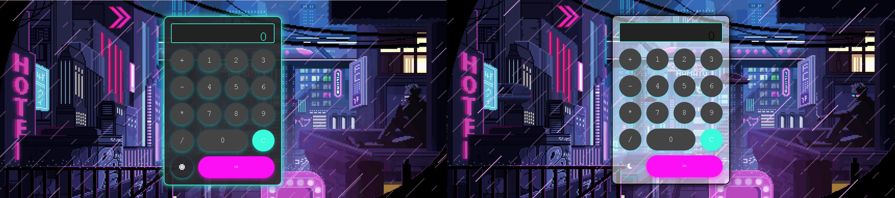

# Futuristic Calculator

Welcome to the **Futuristic Calculator** project! This web-based calculator combines a modern, sleek interface with powerful functionality, designed to provide users with a seamless and enjoyable experience. Built using HTML, CSS, and JavaScript, the calculator offers a host of features that elevate it beyond traditional calculators.



## Features

- **Interactive Design:** 
  - Visually appealing buttons with hover effects enhance user interaction, making calculations feel intuitive and engaging.

- **Theme Toggle:** 
  - Users can easily switch between light and dark themes using intuitive sun and moon icons. This feature allows for a customizable experience, catering to different user preferences and lighting conditions.

- **Animation and Background:** 
  - The background features a captivating GIF that adds a futuristic touch, creating an engaging visual environment without distracting from the primary functionality.


## Technologies Used

- **HTML:** 
  - The backbone structure of the calculator interface, ensuring accessibility and semantic markup.

- **CSS:** 
  - Comprehensive styling and layout, emphasizing modern design principles and responsive techniques for a polished look.

- **JavaScript:** 
  - Implements core functionality for calculations, event handling, and theme switching, ensuring smooth and dynamic interactions.

## Installation

To run this project locally, follow these simple steps:

1. Clone the repository to your local machine:
   ```bash
   git clone https://github.com/DagcanS/Futuristic-Calculator.git
   ```
   
2. Navigate to the project directory and open the `index.html` file in your web browser.

## License

This project is licensed under the MIT License, allowing for freedom to use, modify, and distribute the software.

